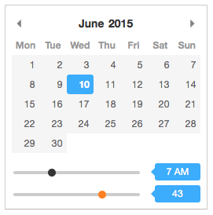

Pikaday - with Time Range Inputs
================================

<<<<<<< HEAD
This is an ie10+ fork of [Owen Mead-Robins'][owenmead] version of [David Bushell's][david Pika] Pikaday,
it does the same but with HTML5 range inputs.



=======
This is an ie10+ fork of [Owen Mead-Robins'][owenmead] version of [dbushell/Pikaday][david Pika],
it does the same but with HTML5 range inputs.

### Pikaday config see [dbushell/Pikaday][david Pika]

### Pikaday time config ([owenmead/Pikaday][owenmead])

```javascript
showTime: true
showSeconds: false
use24hour: false
```

## Authors

* [David Bushell][david Pika]
* [Owen Mead-Robins][owenmead]

[david Pika]:   https://github.com/dbushell/Pikaday                              "Pikaday"
[owenmead]:     https://github.com/owenmead/Pikaday                              "Pikaday - With Time Picker"